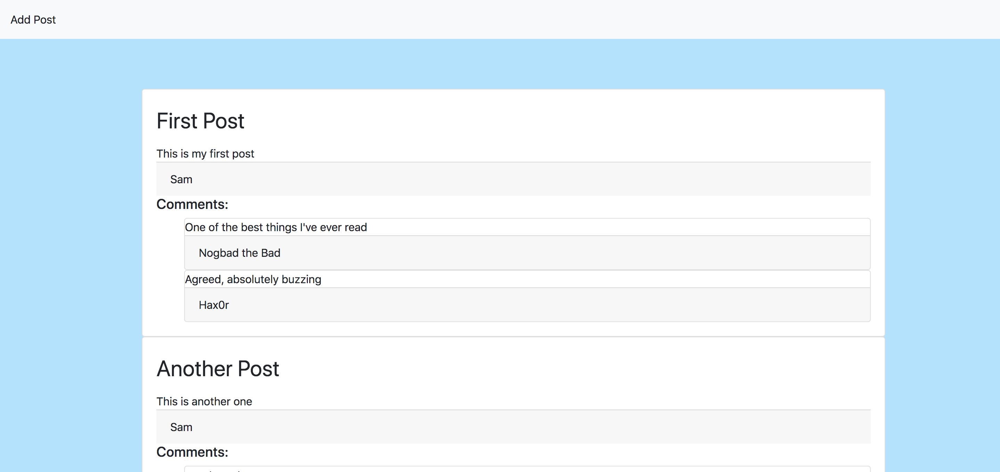
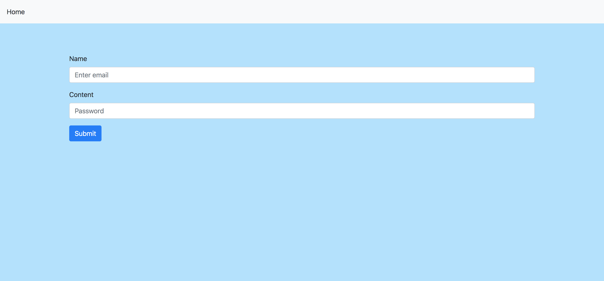

# DB Challenge: Message Board App

Your challenge is to build a web app that will function as a message board. Posts should be persisted in a database.

## Basic Functionality
- A user should be able to fill in a form, providing their name and a message.
```
As a user,
So that I can share a message with others,
I would like to be able to post a message and my name
```

- Once the form has been submitted, their post should be displayed on the main page.
```
As a user,
So that I know my message has been posted,
I would like to be able to see it on the main page
```

- All posts should be displayed in reverse chronological order
```
As a user,
So that I can more easily stay up-to-date,
I would like to see the posts with the most recent first
```

## Advanced functionality
- Users should have the option to comment on existing posts.
```
As a second user,
So that I can start a discussion on a topic,
I would like to be able to comment on a post
```

- Comments should appear below the post they are responding to.
```
As a second user,
So that I know my comment has been posted in the right place,
I would like to see my comment below the post I am responding to
```

# Stretch goal
- Add authentication to the app - users should be asked to register and log in prior to posting or leaving comments.
```
As a user,
So that the board does not become cluttered unnecessarily,
I should have to register and login before posting
```

- Users should be able to edit or delete their own posts or comments, but not those belonging to others.
```
As a user,
So that I can control my content,
I would like to be able to edit or delete my own posts
```

## Proposed screens:

Here are some suggested screens, but feel free to change the content, style and flow to make it your own.




<!-- BEGIN GENERATED SECTION DO NOT EDIT -->

---

**How was this resource?**  
[😫](https://airtable.com/shrUJ3t7KLMqVRFKR?prefill_Repository=skills-workshops&prefill_File=practicals/databases/blog/README.md&prefill_Sentiment=😫) [😕](https://airtable.com/shrUJ3t7KLMqVRFKR?prefill_Repository=skills-workshops&prefill_File=practicals/databases/blog/README.md&prefill_Sentiment=😕) [😐](https://airtable.com/shrUJ3t7KLMqVRFKR?prefill_Repository=skills-workshops&prefill_File=practicals/databases/blog/README.md&prefill_Sentiment=😐) [🙂](https://airtable.com/shrUJ3t7KLMqVRFKR?prefill_Repository=skills-workshops&prefill_File=practicals/databases/blog/README.md&prefill_Sentiment=🙂) [😀](https://airtable.com/shrUJ3t7KLMqVRFKR?prefill_Repository=skills-workshops&prefill_File=practicals/databases/blog/README.md&prefill_Sentiment=😀)  
Click an emoji to tell us.

<!-- END GENERATED SECTION DO NOT EDIT -->
